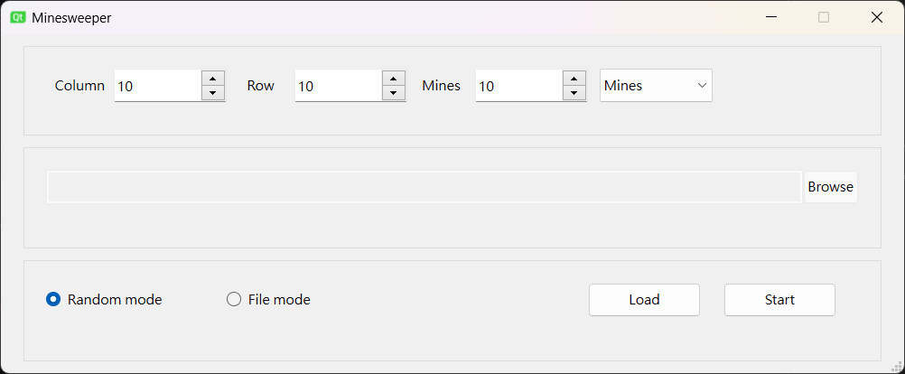
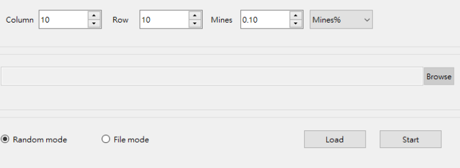
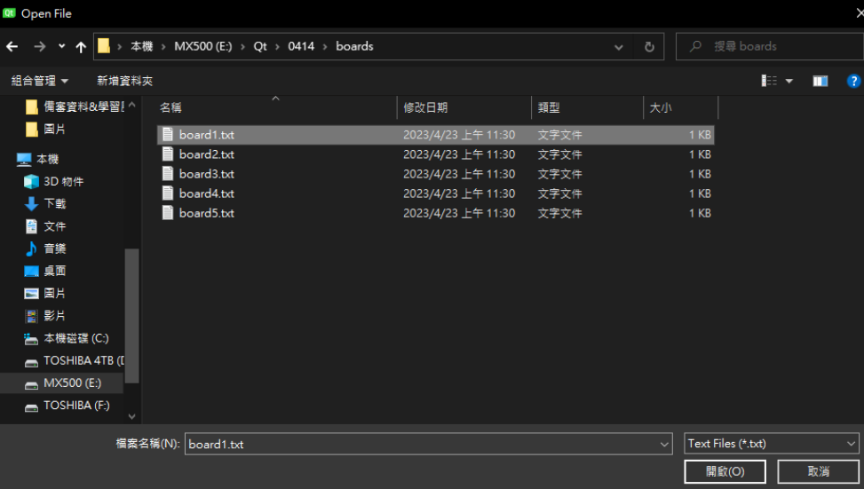
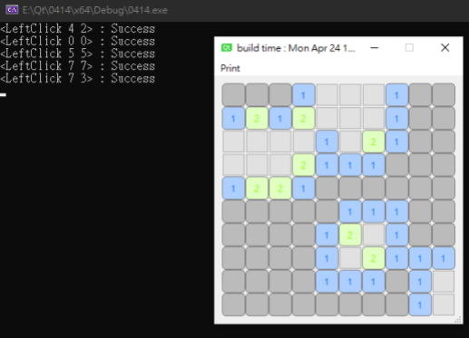
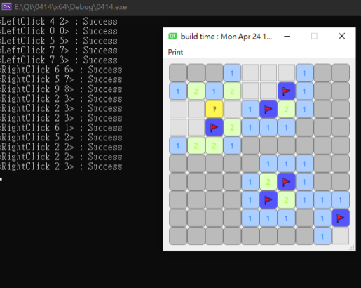
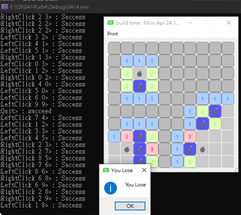
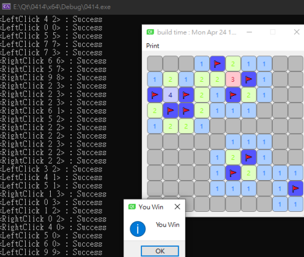

# Minesweeper

A Classic Minesweeper

### Using

to run at GUI mode

./Minesweeper.exe GUI

Language: C++
Main contributor: 劉耀恩

	
### How to play

 Download zip file "minesweeper.exe" first.
#### Play Modes
 
 
 Mines set ramdomly.
 
 
 Control the mine's numbers by using mines percent.
 
 
 Mines set in the file. 


Click left click in the mine map.


Click right click display flag, and click right click again display "?" .


Click left click to the bomb, then you lose the game.


Complete the game, and find each bomb location.

### File List
```
main.cpp
MineSweeperElement.cpp
CommandLine.cpp
CommandMap.cpp
CommandMode.cpp
GameWindow.cpp
generateMinesweeperBoard.cpp
RunMode.cpp
StartWindow.cpp
```

